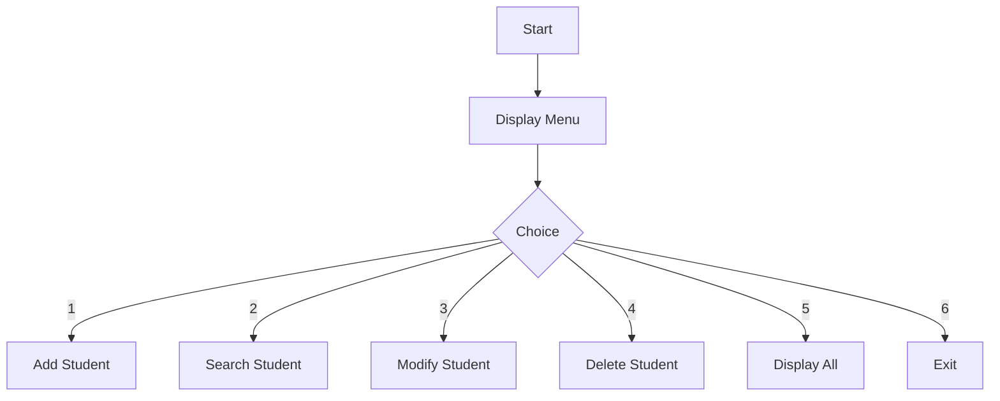

# 🎓 Student Management System (C++)

## 📌 Overview

This project is a **menu-driven Student Management System** developed in C++ using a **singly linked list**. It allows users to manage student records dynamically without any fixed size limitation.

---

## 🚀 Features

* ➕ Add Student
* 🔍 Search Student (by Roll Number)
* ✏️ Modify Student Details
* ❌ Delete Student
* 📋 Display All Students
* 🔁 Menu-driven interface

---

## 🧠 Methodology

The system is implemented using a **linked list data structure**, where each student record is stored in a node.

* Dynamic memory allocation (`new`, `delete`) is used
* Each node stores student details and a pointer to the next node
* Operations like insertion, deletion, and traversal are performed using pointers
* A `while` loop with `switch-case` controls the menu

---

## ⚙️ Technologies Used

* Language: C++
* Concepts:

  * Linked List
  * Pointers
  * Dynamic Memory Allocation
  * File Handling *(optional enhancement)*

---

## 📊 Flowchart



---

## 🏗️ Data Structure

Each student is stored as a node:

```cpp
class node {
public:
    int roll_no, phone_no;
    string name, address, mail_id;
    node* link;
};
```

---

## ▶️ How to Run

1. Compile the code:

```bash
g++ student.cpp -o student
```

2. Run the program:

```bash
./student
```

---

## 📷 Sample Output

```
===== STUDENT MANAGEMENT SYSTEM =====
1. Add Student
2. Search Student
3. Modify Student
4. Delete Student
5. Display All Students
6. Exit
```

---

## 🔮 Future Improvements

* 💾 File handling (save data permanently)
* 🔍 Search by name
* 📊 Sorting students
* 🖥️ GUI interface

---

## 👨‍💻 Author

Venkata Tejaswi Surimalla
Susmitha Bandela
Naga Ramlal Dodda
Arjun Adithya
---

## 📜 License

This project is for educational purposes.
